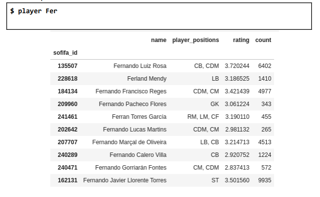

# FIFA Players: CSV Database Search Project
This project was made as the final assesment for the Data Analysis (Cassificação e Pesquisa de Dados) class in the Federal University of Rio Grande do Sul (UFRGS). 
 
The project consists of reading 3 different files from a database (Players, Ratings and Tags) and building data structres, such as Hash Tables and Trie Trees (all built from scratch) that allow the user to perform searches within the database. These searches go from getting the top players at a certain position, to getting a player's data by searching a prefix of his name, or even getting all the reviews that a certain user has given to different players.
 
The 3 CSV files that are read to create the structures are:  
<b>PLAYERS</b>: Each line contains a player's id, full name and the positions he plays in.
 
<b>RATINGS</b>: Each line contains a user's id, the player he's rating and the rating itself from 0 to 5. (this file contains millions of ratings)
 
<b>TAGS</b>: Each line contains a user' id, a player's id and a tag that the user associated with that player, representing a comment on that player by the user.
 
To reach the goal of having a quickly searchable database, this program contains 2 main data structures: a Hash Table and a TRIE tree, built from sratch using object-oriented programming. The hash table deals with collision of keys by creating sub-lists in each line, allowing for fast insertion and search methods. The TRIE tree also crates a quicly searchable database of strings.  
Here are the 4 types of searches you can perform on this project:  
<b>1: SEARCH PLAYERS_NAME BY PREFIX</b>  
By searching a player's name prefix, the program quickly finds that player in the database and displays all his information: id, average rating, positions, etc  

 
<b>2: SEARCH THE TOP N PLAYERS IN A POSITION</b>  
With N being any positive number, the program gets the N top rated players in the position passed as an argument.  

 
<b>3: SEARCH THE ALL PLAYERS WITH A LIST OF TAGS</b>  
By searching a list of tags, the program displays all players that have been simultaneously given those tags by users  

 
<b>4: SEARCH A USER BY ID</b>  
By searching a user by his id, the program displays data from all players he rated, togehter with the rating the user themselves gave each one  

 
